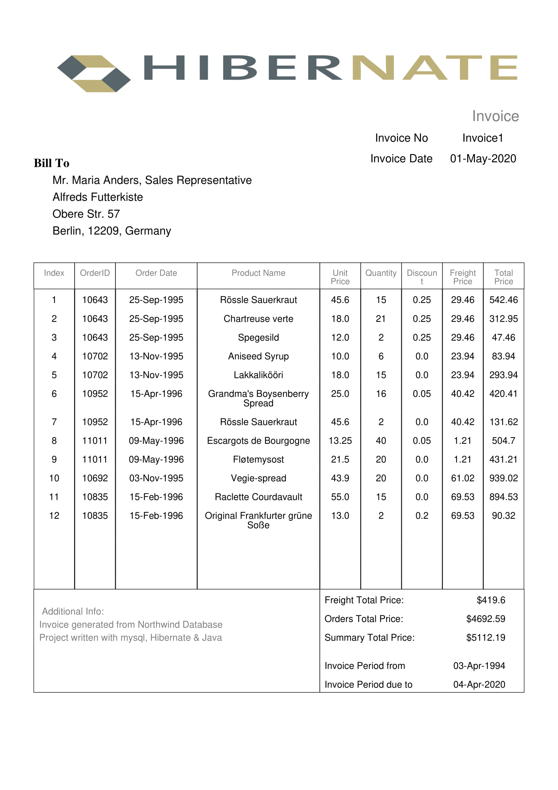

# InvoiceGenerator
## HibernateProject

[]()
[]()
[]()
[]()

## Project description
InvoiceGenerator is a project made for DatabaseCourse in AGH University of Science and Technology in Krakow as a task showcasing designing, programming and documenting a project in Java, Hibernate and mySQL. 

## Showcase
#### Inputed Data:
```json
{
  "startDate": "1994-04-03 00:00:00",
  "endDate": "2020-04-04 00:00:00",
  "customerID": "ALFKI"
}
```
#### Generated Invoice
[Example Of Generated Invoice in PDF](src/main/resources/Alfreds_Futterkiste_invoice.pdf)  
  



